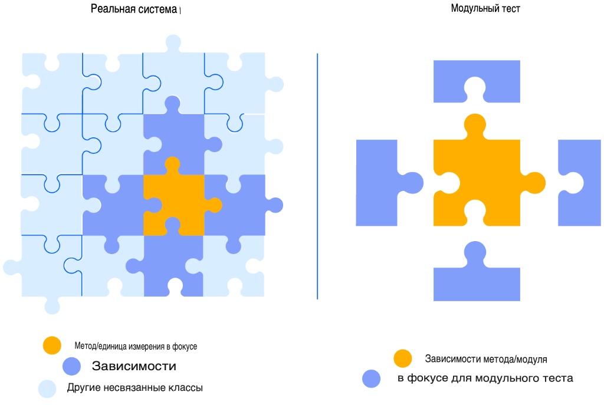
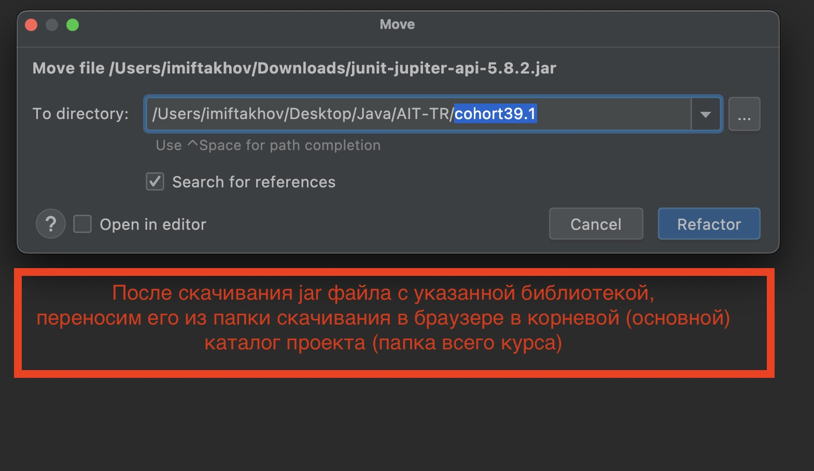
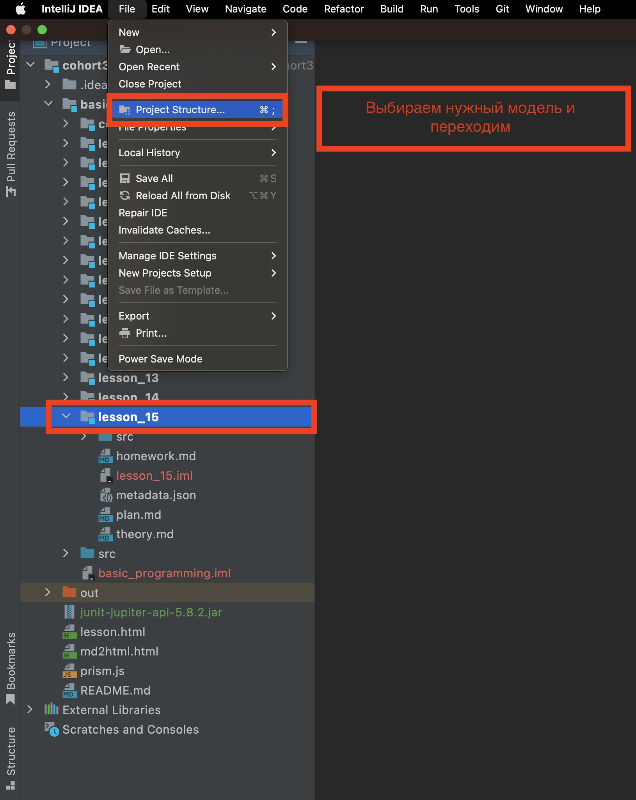
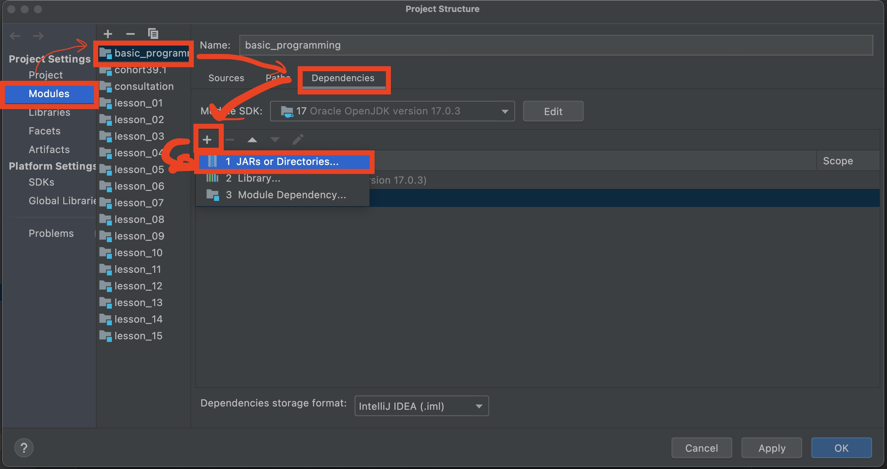
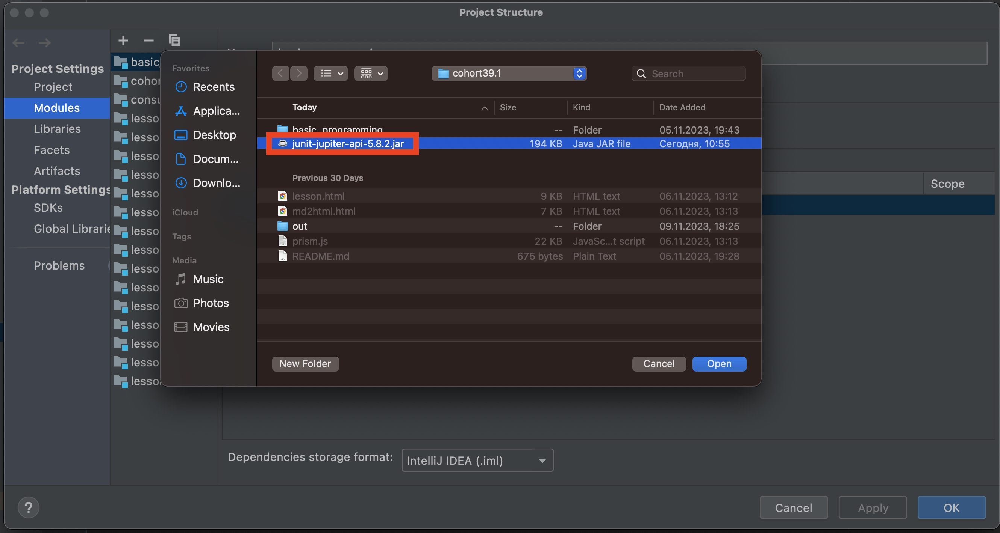
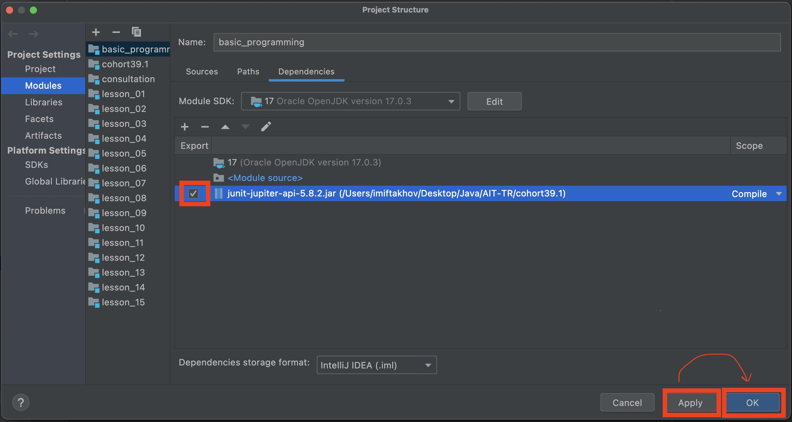
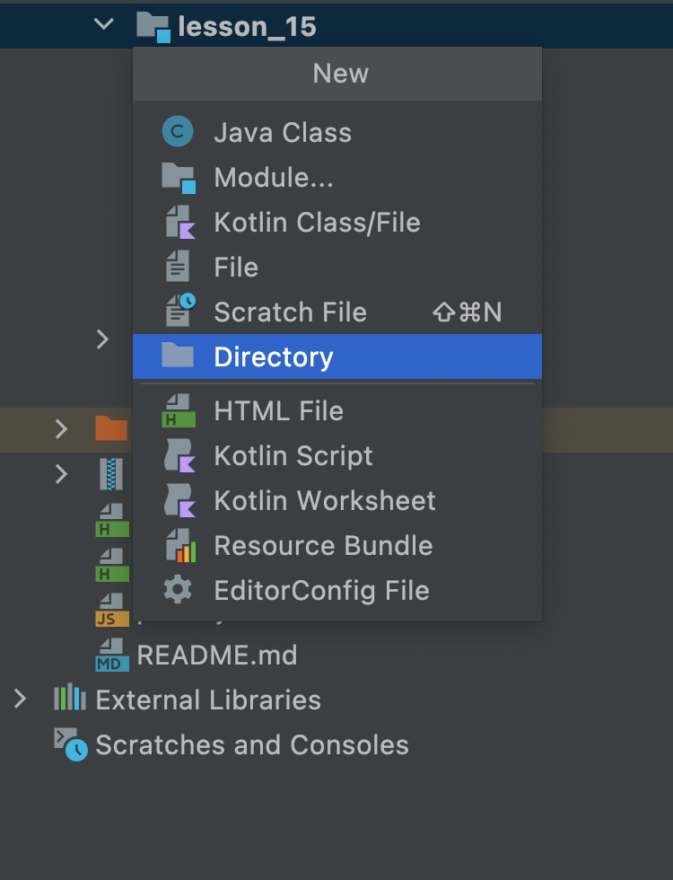
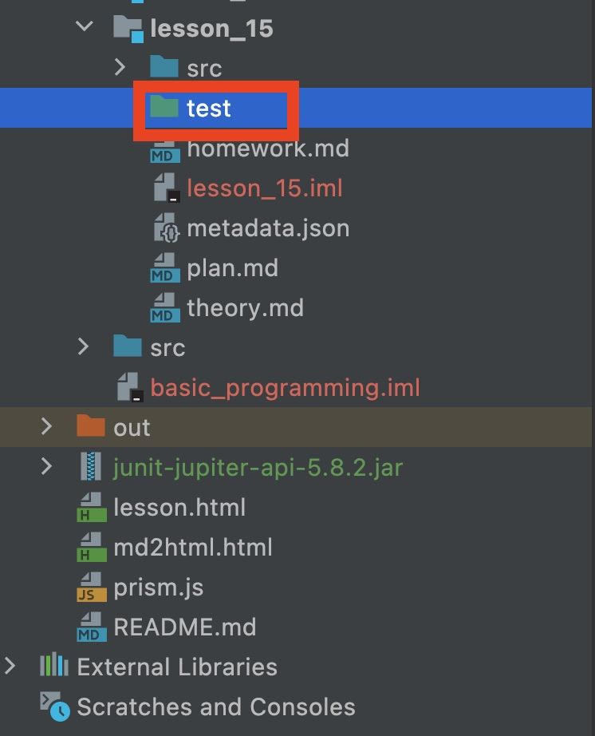

<details style="margin-left: 20px;">
<summary><strong><em> Lesson 13. Введение в методы, методы void, аргументы и перегрузка методов: (нажмите на треугольник, чтобы развернуть текст)</em></strong></summary>

# Lesson 13

## Введение в Методы в Java

Методы в Java являются одним из фундаментальных инструментов в программировании, позволяющих структурировать и
организовывать код.

### Определение Метода

> - **Что такое Метод:** В Java метод представляет собой блок кода, который выполняет определенную задачу. Он
    определяется в классе и может быть вызван многократно, как внутри класса, так и из других классов.
> - **Структура Метода:** Метод состоит из имени, списка параметров, тела метода и возвращаемого типа (или `void`, если
    метод ничего не возвращает).

### Зачем Нужны Методы

1. **Упрощение Кода:**
    - Методы позволяют разбивать сложные задачи на более мелкие и управляемые части, упрощая тем самым код.

2. **Повторное Использование:**
    - Один и тот же метод может быть вызван несколько раз с разными данными, что способствует повторному использованию
      кода и снижению избыточности.

3. **Улучшение Читаемости:**
    - Хорошо структурированные методы с понятными именами улучшают читаемость кода, делая его более понятным и удобным
      для восприятия.

### Пример Простого Метода

```java
public int add(int a,int b){
        System.out.println(a+b);
        }
```

В этом примере `add` - это метод, который принимает два параметра `a` и `b` и возвращает их сумму. Такой метод может быть
вызван многократно с разными значениями для `a` и `b`.

> <details style="margin-left: 20px;">
> <summary><strong><em> Пример, уже регенный вами в дз: (нажмите на треугольник, чтобы развернуть текст)</em></strong></summary>
>
> Было:
> ```java
> public class TemperatureConverter {
>   public static void main(String[] args) {
>       double celsius = 100;
>       double fahrenheit = 212;
>
>       double celsiusToFahrenheit = (celsius * 9 / 5) + 32;
>       double fahrenheitToCelsius = (fahrenheit - 32) * 5 / 9;
>       System.out.println(celsius + " °C = " + celsiusToFahrenheit + " °F");
>       System.out.println(fahrenheit + " °F = " + fahrenheitToCelsius + " °C");
>   }
> }
> ```
>
>  Стало:
> 
> ```java
>
> public class TemperatureConverter {
>
>     public static void main(String[] args) {
>         double celsius = 100;
>         double fahrenheit = 212;
>
>         System.out.println(celsius + " °C = " + celsiusToFahrenheit(celsius) + " °F");
>         System.out.println(fahrenheit + " °F = " + fahrenheitToCelsius(fahrenheit) + " °C");
>     }
>
>     // Конвертирует температуру из Цельсия в Фаренгейты
>     public static void celsiusToFahrenheit(double celsius) {
>         System.out.println(celsius + " °C = " + ((celsius * 9 / 5) + 32)  + " °F");
>     }
>
>     // Конвертирует температуру из Фаренгейтов в Цельсии
>     public static void fahrenheitToCelsius(double fahrenheit) {
>         System.out.println(fahrenheit + " °F = " +  (fahrenheit - 32) * 5 / 9  + " °C" );
>     }
> }
> ```
> </details>

> <details style="margin-left: 20px;">
> <summary><strong><em> Бытовая Аналогия для Методов в Java: (нажмите на треугольник, чтобы развернуть текст)</em></strong></summary>
> 
> ## Аналогия 1
> 
> Методы в программировании можно сравнить с рецептами в кулинарии.
> 
> ### Сходство с Кулинарным Рецептом
> 
> > - **Четкие Инструкции:** Так же, как кулинарный рецепт содержит четкие инструкции о том, как приготовить блюдо, метод в программировании содержит инструкции для выполнения определенной задачи.
> > - **Повторное Использование:** Как рецепт может использоваться для приготовления блюда многократно, так и метод может быть вызван многократно в программе.
> > - **Передача Ингредиентов (Параметров):** В рецепте ингредиенты адаптируются в зависимости от желаемого количества блюда, аналогично параметрам, передаваемым в метод.
> > - **Результат (Возвращаемое Значение):** Как результатом следования рецепта является готовое блюдо, так результатом выполнения метода может быть возвращаемое значение.
>
> ##  Аналогия 2
>
> Методы в программировании можно сравнить с машиностроительным конвейером.
>
> ### Сходство с Конвейером
>
> > - **Повторяемые Действия:** Так же, как конвейер выполняет одинаковые действия для создания продукта, методы в программировании представляют собой набор инструкций, которые выполняются для достижения определенной задачи.
> > - **Эффективность и Стандартизация:** Конвейер обеспечивает эффективное и стандартное производство, аналогично методам, обеспечивающим стандартный подход к решению задач и повышающим эффективность кода.
> > - **Передача Материалов (Параметров):** Как на конвейер подаются различные материалы для обработки, так в методы передаются параметры, которые затем обрабатываются инструкциями метода.
> > - **Гибкость в Производстве:** Так же, как конвейер может адаптироваться для создания различных продуктов, методы могут быть универсальными и адаптироваться к различным задачам, благодаря передаче разных параметров.
>
> Эта аналогия помогает понять, как методы обеспечивают стандартизированный и эффективный способ решения задач в программировании, аналогично работе конвейера в производстве.
> </details>

> <details style="margin-left: 20px;">
> <summary><strong><em> Пример декомпозиции кода: (нажмите на треугольник, чтобы развернуть текст)</em></strong></summary>
>
> ```java
> public class MainExample {
>     public static void main(String[] args) {
>         // Первое действие
>         for (int i = 0; i < 5; i++) {
>             System.out.println("Повторение: " + i);
>         }
>
>         // Второе действие
>         for (int i = 0; i < 5; i++) {
>             System.out.println("Повторение: " + i);
>         }
>
>         // Третье действие
>         for (int i = 0; i < 5; i++) {
>             System.out.println("Повторение: " + i);
>         }
>     }
> }
> 
> ```
>
> ```java
> public class MethodExample {
>     public static void main(String[] args) {
>         printRepetitions();
>         printRepetitions();
>         printRepetitions();
>     }
>
>     public static void printRepetitions() {
>         for (int i = 0; i < 5; i++) {
>             System.out.println("Повторение: " + i);
>         }
>     }
> }
>
> ```
> </details>

## Основы Методов в Java 

### Синтаксис Объявления Метода

> - **Модификаторы Доступа:** Определяют область видимости метода, например, `public`, `private`, `protected`.
> - **Тип Возвращаемого Значения:** Указывает на тип данных, который метод возвращает. Если метод ничего не возвращает, используется ключевое слово `void`.
> - **Имя Метода:** Следует правилам именования в Java и должно отражать действие, выполняемое методом.
> - **Параметры:** Список входных параметров метода, заключенных в скобки. Метод может не иметь параметров.

### Примеры Простых Методов

```java
public int add(int a,int b){
        System.out.println(a+b);
        }

public void printMessage() {
    System.out.println("Это простой метод");
}
```

Первый метод `add` печатает сумму двух чисел, второй метод `printMessage` печатает сообщение и не возвращает значение.

### Понятие Сигнатуры Метода
 - **Сигнатура Метода:** Уникальная комбинация имени метода и списка его параметров. Не включает возвращаемый тип и модификаторы доступа.
 - **Значение:** Сигнатура используется для определения уникальности методов в классе, особенно при перегрузке методов.

### Возвращаемые Значения и Void Методы
 - **Возвращаемые Значения:** Методы могут возвращать данные любого типа, определенного в их сигнатуре.
 - **Void Методы:** Методы с ключевым словом `void` не возвращают значения. Используются для выполнения действий, 
например, печати сообщения.

> <details style="margin-left: 20px;">
> <summary><strong><em> Бытовая Аналогия: (нажмите на треугольник, чтобы развернуть текст)</em></strong></summary>
>
> ## Бытовая Аналогия 1. 
>
> ### Методы, Возвращающие Значение
>
> > - **Похоже на Покупку в Магазине:** Метод, возвращающий значение, можно сравнить с походом в магазин. Когда вы идете в магазин за конкретным товаром, вы ожидаете вернуться с этим товаром. Так же и метод возвращает результат (товар) после выполнения своих действий (похода в магазин).
>
> ### Void Методы
>
> > - **Похоже на Выполнение Упражнений:** Void метод можно сравнить с выполнением упражнений. Когда вы делаете упражнения, вы не ожидаете получить что-то в руки после их выполнения. Вместо этого, цель упражнений - изменить состояние вашего тела (улучшить здоровье, физическую форму). Аналогично, `void` методы выполняют действия, но не возвращают результат.
>
> Эти аналогии помогают понять разницу между методами, возвращающими значение, и `void` методами: первые возвращают результат, в то время как последние выполняют действия без возвращения конкретного значения.
> 
> ## Бытовая Аналогия 2.
>
> Методы в программировании можно сравнить с различными типами помощников: домашними помощниками и курьерами.
>
> ### Void Методы как Домашние Помощники
>
> > - **Выполнение Работы Без Конкретного "Продукта":** Void методы можно сравнить с домашними помощниками или ассистентами. Такой помощник выполняет работу (например, уборку, готовку), но не приносит вам конкретный физический объект в результате своей работы. Это подобно `void` методам, которые выполняют задачи, но не возвращают никакого значения.
>
> ### Методы с Возвращаемым Значением как Курьеры
>
> > - **Приносят Конкретные "Вещи":** Методы, возвращающие значение, можно сравнить с курьерами или сотрудниками, которые приносят вам что-то конкретное (например, пакет или отчет). Как курьер приносит заказанный товар, так и метод возвращает конкретное значение, результат своей работы.
>
> Эта аналогия помогает понять различие между `void` методами, выполняющими действия без возвращения результата, и методами с возвращаемым значением, предоставляющими конкретный результат их работы.
> </details>

> <details style="margin-left: 20px;">
> <summary><strong><em> Пример кода: (нажмите на треугольник, чтобы развернуть текст)</em></strong></summary>
>
> ```java
> public class ArrayOperations {
>
>     public static void main(String[] args) {
>         int[] numbers = {1, 2, 3, 4, 5};
>
>         // Вызов void метода
>         printSum(numbers);
>
>         // Вызов не-void метода и вывод результата
>         int sum = calculateSum(numbers);
>         System.out.println("Сумма (возвращаемое значение): " + sum);
>     }
>
>     // Void метод для печати суммы элементов массива
>     public static void printSum(int[] array) {
>         int sum = 0;
>         for (int num : array) {
>             sum += num;
>         }
>         System.out.println("Сумма (void метод): " + sum);
>     }
>
>     // Метод, возвращающий сумму элементов массива
>     public static int calculateSum(int[] array) {
>         int sum = 0;
>         for (int num : array) {
>             sum += num;
>         }
>         return sum;
>     }
> }
>
> ```
> </details>

### Передача Аргументов в Методы
 - **Значение По Значению:** В Java все примитивные типы передаются по значению. Это означает, что копия значения передается в метод.
 - **Значение По Ссылке:** Объекты передаются по ссылке, что позволяет методам влиять на состояние переданных объектов.

> <details style="margin-left: 20px;">
> <summary><strong><em> Пример кода: (нажмите на треугольник, чтобы развернуть текст)</em></strong></summary>
>
> ```java
> public class ArrayModificationExample {
>
>     public static void main(String[] args) {
>         int[] numbers = {1, 2, 3, 4, 5};
>
>         System.out.println("Массив до изменения: " + java.util.Arrays.toString(numbers));
>
>         // Вызов метода, изменяющего массив
>         modifyArray(numbers);
>
>         System.out.println("Массив после изменения: " + java.util.Arrays.toString(numbers));
>     }
>
>     // Void метод, который изменяет массив
>     public static void modifyArray(int[] array) {
>         // Пример изменения: увеличиваем каждый элемент массива на 10
>         for (int i = 0; i < array.length; i++) {
>             array[i] += 10;
>         }
>    }
> }
>
> ```
> </details>

> <details style="margin-left: 20px;">
> <summary><strong><em> Бытовая Аналогия: (нажмите на треугольник, чтобы развернуть текст)</em></strong></summary>
>
> ## Аналогия 1. 
>
> Аргументы, передаваемые в методы, можно сравнить с ингредиентами рецепта или материалами для ремонта.
>
> ### Ингредиенты Рецепта как Примитивные Типы (Передача по Значению)
> > - **Одноразовое Использование:** Представьте, что вы передаете кулинару ингредиенты для приготовления блюда. Как
      только ингредиенты добавлены в блюдо, они не могут быть возвращены в исходном виде. Это похоже на передачу
      примитивных типов данных в метод: копия значения передается, и изменения не затрагивают исходный аргумент.
> ### Материалы для Ремонта как Объекты (Передача по Ссылке)
> > - **Изменение Состояния:** Теперь представьте, что вы даете ремонтнику инструменты для работы. Ремонтник использует
      эти инструменты, возможно, изнашивая их или меняя их состояние. Это похоже на передачу объектов в методы в
      программировании. Передается ссылка на объект, и любые изменения в методе отражаются на самом объекте.
> 
> Эта аналогия помогает понять разницу между передачей аргументов по значению и по ссылке в программировании: в первом
> случае передается копия значения (как ингредиенты), во втором - доступ к самому объекту (как инструменты).
>
> ## Аналогия 2. 
> Аргументы в методах можно сравнить с заказом в ресторане или с документами, предоставляемыми для обработки.
>
> ### Заказ в Ресторане как Примитивные Типы (Передача по Значению)
> > - **Индивидуальное Исполнение:** Представьте, что вы делаете заказ в ресторане, например, стейк средней прожарки.
      Заказ - это ваше значение, которое передается повару (методу). Повар готовит стейк согласно заказу, но сам заказ
      не изменяется. Это похоже на передачу примитивных типов данных в метод: метод получает значение (заказ), но
      оригинальный заказ остаётся неизменным.
>
> ### Документы для Обработки как Объекты (Передача по Ссылке)
>  - **Изменение Содержимого:** Теперь представьте, что вы предоставляете бухгалтеру пачку документов для отчетности.
      Бухгалтер (метод) работает с этими документами, изменяя их содержимое или дополняя. После обработки содержимое
      документов изменилось. Это аналогия передачи объектов в методы программирования: метод работает непосредственно с
      объектом (документами), изменяя его состояние.
>
> Эта аналогия помогает понять разницу между передачей аргументов по значению и по ссылке: в первом случае метод
> работает с копией данных (заказ в ресторане), во втором - непосредственно с объектом (документы для обработки).
>
> </details>

> <details style="margin-left: 20px;">
> <summary><strong><em> Пример декомпозиции: (нажмите на треугольник, чтобы развернуть текст)</em></strong></summary>
>
> Было:
>  ```java
> public class MainClass {
>     public static void main(String[] args) {
>         // Вывод приветствия
>         System.out.println("Привет, мир!");
>
>         // Печать числа 5 в квадрате
>         int number = 5;
>         int square = number * number;
>         System.out.println("Квадрат числа " + number + " равен " + square);
>
>         // Перевод строки в верхний регистр
>         String str = "Привет!";
>         String upperStr = str.toUpperCase();
>         System.out.println(upperStr);
>     }
> }
> ```
>
>  Стало:
>
>  ```java
> public class MainClass {
>
>     public static void main(String[] args) {
>         printGreeting();
>         printSquare(5);
>         printUpperCase("Привет!");
>     }
>
>     // Метод без аргументов
>    public static void printGreeting() {
>         System.out.println("Привет, мир!");
>     }
>
>    // Метод с аргументами
>     public static void printSquare(int number) {
>         int square = number * number;
>         System.out.println("Квадрат числа " + number + " равен " + square);
>     }
>
>     // Метод с аргументами
>     public static void printUpperCase(String str) {
>         String upperStr = str.toUpperCase();
>         System.out.println(upperStr);
>     }
> }
>  ```
> </details>

В Java аргументы методов являются ключевым компонентом для передачи данных в методы и взаимодействия с ними. Понимание, как работают аргументы, важно для эффективного использования методов.

#### Использование Аргументов в Методе

 - **Передача Аргументов:** При вызове метода, аргументы передаются методу в том порядке, в котором они указаны в определении метода.
 - **Внутри Метода:** Аргументы используются в методе как локальные переменные. Их можно читать и (если они не являются примитивными типами или не объявлены как `final`) изменять.

#### Примеры Методов с Аргументами
 - **Метод с Одним Аргументом:**
   ```java
   public void printMessage(String message) {
       System.out.println(message);
   }
   ```

  Метод принимает один аргумент `message` и выводит его.


 - **Метод с Несколькими Аргументами Разного Типа:**
   ```java
   public void printDetails(String name, int age) {
      System.out.println("Name: " + name + ", Age: " + age);
   }
   ```
  Метод принимает два аргумента: строку `name` и целое число `age`.


#### Методы с Несколькими Аргументами Одного Типа

- **Пример с Тремя Аргументами Одного Типа:**
  ```java
   public void printCoordinates(int x, int y, int z) {
       System.out.println("Координаты: X=" + x + ", Y=" + y + ", Z=" + z);
   }
   ```
   В этом примере метод `printCoordinates` принимает три целочисленных аргумента. Каждый аргумент представляет собой координату в трехмерном пространстве. Метод затем выводит эти координаты.

 - **Работа с Аргументами:**
   - Каждый аргумент внутри метода используется как отдельная переменная.
   - Метод может выполнять различные операции с этими аргументами, например, вычислять их сумму или среднее значение.

#### Важные Моменты

 - **Ясность Именования:** При работе с несколькими аргументами одного типа важно давать им понятные и описательные имена, чтобы код был читаемым.
 - **Порядок Аргументов:** Порядок, в котором аргументы перечислены в определении метода, имеет значение. При вызове метода аргументы должны быть переданы в том же порядке.

<details style="margin-left: 20px;">
<summary><strong><em> Пример использования нескольких аргументов: (нажмите на треугольник, чтобы развернуть текст)</em></strong></summary>

```java
public class DistanceCalculator {

    public static void main(String[] args) {
        // кооржинаты точки 1
        double[] point1 = {1.0, 2.0, 3.0};
        // кооржинаты точки 1
        double[] point2 = {4.0, 5.0, 6.0};

        calculateDistance(point1, point2);
    }

    // Метод для вычисления расстояния между двумя точками в 3D пространстве
    public static void calculateDistance(double[] point1, double[] point2) {
        if (point1.length != 3 || point2.length != 3) {
            System.err.println("Каждая точка должна иметь три координаты.");
            // останавливаем выполнение метода
            return;
        }

        double distance =  Math.sqrt(Math.pow(point2[0] - point1[0], 2) +
                         Math.pow(point2[1] - point1[1], 2) +
                         Math.pow(point2[2] - point1[2], 2));
        System.out.println("Расстояние между точками: " + distance);
    }
}

```
</details>

#### Заключение

Понимание работы аргументов в методах позволяет более гибко управлять данными в программе. Методы с разными аргументами увеличивают многозадачность и универсальность кода, обеспечивая возможность его повторного использования в различных контекстах.


## Параметры и Перегрузка Методов в Java 

### Работа с Параметрами

**Обязательные и Необязательные Аргументы:** В Java все параметры, указанные в определении метода, являются
обязательными. Для реализации необязательных параметров используются перегруженные методы или методы с переменным числом
аргументов (varargs).

### Перегрузка Методов

 - **Определение:** Перегрузка методов (Method Overloading) в Java - это возможность создавать несколько методов с одинаковым именем, но с разными параметрами (разное количество или типы параметров).
 - **Примеры:**
>   ```java
>   public void print(String message) { /*...*/ }
>   public void print(String message, int times) { /*...*/ }
>   ```
> 
Оба метода называются `print`, но имеют разные параметры. 
**Правила:**
 - Перегруженные методы должны отличаться количеством или типом параметров.
 - Недопустимо иметь перегруженные методы, отличающиеся только возвращаемым типом.

### Важность Перегрузки Методов

 - **Гибкость:** Перегрузка методов позволяет использовать одно и то же имя метода для различных вариаций его выполнения, что упрощает чтение и понимание кода.
 - **Удобство:** Улучшает пользовательский опыт при работе с классами и объектами, предоставляя разные способы для достижения одной цели.
 - **Читаемость и Организация Кода:** Помогает организовать код более логично, группируя похожие действия под одним именем метода.

</details>

------

<details style="margin-left: 20px;">
<summary><strong><em> Lesson 14. Ключевое слово return. Методы с возвращаемым типом значения: (нажмите на треугольник, чтобы развернуть текст)</em></strong></summary>

# Lesson14

### Введение: Void Методы и Методы с Возвращаемым Типом в Java

#### Краткий Обзор `Void` Методов

- **Определение:** `Void` методы в Java - это методы, которые не возвращают значение. Они обычно используются для
  выполнения операций, таких как вывод данных на экран или запись в лог-файл.
- **Примеры в Мобильных Приложениях:**
  > - **Обработка Нажатий:** В мобильном приложении методы типа `void` часто используются для обработки событий,
      например, нажатий на кнопки. Например, метод `onClick` может быть `void` и вызываться, когда пользователь нажимает
      на кнопку, инициируя определенное действие.
  >   - **Обновление Интерфейса Пользователя:** Методы, обновляющие элементы пользовательского интерфейса, такие как
        изменение текста в текстовом поле или обновление изображений.

#### Введение в Методы с Возвращаемым Типом

- **Основное Отличие:** В отличие от `void` методов, методы с возвращаемым типом завершают своё выполнение возвращением
  значения. Эти методы могут возвращать данные любого типа, например, числа, строки или объекты.
- **Применение:** Методы с возвращаемым типом широко используются для получения данных, выполнения вычислений и
  возвращения результатов. Например, метод, который вычисляет сумму двух чисел и возвращает результат, или метод,
  который запрашивает данные из базы данных и возвращает результат в виде объекта.
- **Примеры в Мобильных Приложениях:**
  > - **Получение Данных:** Методы, возвращающие данные пользователя, например, метод `getUserProfile`, который
      возвращает профиль пользователя в мобильном приложении.
  >   - **Вычислительные Операции:** Методы для выполнения вычислений, например, расчета расстояния между двумя точками
        на карте.

Это введение в `void` методы и методы с возвращаемым типом в Java дает основу для понимания их различий и способов
применения в реальных приложениях, включая мобильные приложения.

### Основы Методов с Возвращаемым Типом в Java

#### Определение и Назначение Методов с Возвращаемым Типом

 - **Определение:** Методы с возвращаемым типом в Java - это методы, которые завершают своё выполнение возвратом значения. Это контрастирует с `void` методами, которые не возвращают никаких данных.
 - **Назначение:** Такие методы используются для выполнения операций, которые должны предоставить результат, например, вычисление значения, получение данных из источника или обработка входных данных.

#### Синтаксис Объявления Методов с Возвращаемым Типом

 - **Общий Синтаксис:**
```java
public <тип возвращаемого значения> <имя метода>(<параметры>) {
      // тело метода
       return <возвращаемое значение>;
   }
 ```
- **Тип Возвращаемого Значения:** Определяет тип данных, который метод будет возвращать. Это может быть любой допустимый тип данных в Java.

#### Примеры Возвращаемых Типов

- **int:** Возвращает целочисленное значение. 
```java
   public int getMax(int a, int b) {
       return (a > b) ? a : b;
   }
```

- **double:** Возвращает число с плавающей точкой. 
```java
  public double calculateAverage(double[] numbers) {
      double sum = 0;
      for (double num : numbers) {
          sum += num;
      }
      return sum / numbers.length;
  }
```
- **String:** Возвращает строку.

```java
  public String greetUser(String name) {
      return "Привет, " + name + "!";
  }
```

- **boolean:** Возвращает логическое значение `true` или `false`.
```java
public boolean isEven(int number) {
      return number % 2 == 0;
  }
  ```

- **Объекты Классов:** Возвращает объект определенного класса.
 ```java
  public User createUser(String name, int age) {
      return new User(name, age);
  }
  ```

#### Возврат Значения из Методов с Возвращаемым Типом

- **Обязательность Возврата Значения:** Если метод в Java объявлен с возвращаемым типом (кроме `void`), то он обязан возвращать значение этого типа. Не выполнение этого условия приведет к ошибке компиляции.
```java
  public int sum(int a, int b) {
      return a + b; // Возвращает сумму двух чисел
  }
```

- **Возврат Одного Значения:** Как правило, метод может возвращать только одно значение. Например, метод, возвращающий `int`, не может вернуть два или более `int` значений одновременно.

- **Возврат Нескольких Значений:** Если требуется вернуть несколько значений одного типа, можно использовать массив или коллекцию этого типа. Например, для возвращения координат точек можно использовать массив `double[]` или список `List<Double>`.
```java
public double[] getCoordinates() {
      double[] coordinates = {x, y, z};
      return coordinates; // Возвращает массив координат
  }
```

- **Использование Объектов для Сложной Информации:** Для возвращения сложной информации, такой как данные о координатах клиентов для курьера, можно использовать объекты специально созданных классов, которые включают в себя необходимые данные.
```java
  public ClientData getClientData() {
      return new ClientData(id, name, location); // Возвращает объект с информацией о клиенте
  }
```

### Перегрузка Методов с Возвращаемым Типом в Java 

#### Перегрузка Методов с Разными Возвращаемыми Типами

 - **Определение:** Перегрузка методов (Method Overloading) - это создание нескольких методов с одинаковым именем, но разными списками параметров в одном классе. Возвращаемые типы могут быть одинаковыми или разными, но для перегрузки ключевым фактором является различие в параметрах.
 - **Примеры:**
>   ```java
>   public int multiply(int a, int b) { /*...*/ }
>   public double multiply(double a, double b) { /*...*/ }
>   ```
  Оба метода выполняют умножение, но принимают разные типы аргументов.

#### Сценарии Использования Перегруженных Методов

 - **Гибкость:** Перегрузка методов позволяет использовать одно и то же имя метода для различных вариаций его выполнения, что упрощает чтение кода и его использование.
 - **Примеры Сценариев:**
Методы для обработки разных типов данных (например, числовые и строковые версии метода).
   - Методы с разным количеством параметров, предоставляющие большую гибкость.

> <details style="margin-left: 20px;">
> <summary><strong><em> Пример использования нескольких аргументов: (нажмите на треугольник, чтобы развернуть текст)</em></strong></summary>
>
> ### Бытовая Аналогия для Перегрузки Методов с Разными Возвращаемыми Типами
>
>#### Аналогия с Универсальным Инструментом
>
> - **Определение:** Представьте универсальный инструмент, например, мультитул, который может выполнять разные функции в
    зависимости от используемой насадки.
> - **Примеры в Реальной Жизни:**
    >   - Как мультитул с разными насадками может выполнять различные задачи (отвертка, нож, пилка), так и перегруженный
    метод может выполнять разные операции в зависимости от типа и количества параметров.
    >
> - **Пример с Кулинарным Процессором:**
  >     - Кулинарный процессор с разными насадками: одна насадка измельчает овощи (возвращает нарезанные овощи), другая
  взбивает крем (возвращает готовый крем). Это похоже на перегрузку методов, где один метод `process` может возвращать
  разные типы результатов в зависимости от параметров.
> - **Важность в Программировании:**
    >   - Так же, как мультитул упрощает работу, не требуя от вас нескольких отдельных инструментов, перегруженные
    методы упрощают структуру программы, позволяя использовать одно и то же имя для методов, выполняющих различные
    функции с разными типами данных.
>
> </details>
</details>

--------

<details style="margin-left: 20px;">
<summary><strong><em> Lesson 15. Введение модульное тестирование. JUnit: (нажмите на треугольник, чтобы развернуть текст)</em></strong></summary>

# Lesson 15. Введение модульное тестирование. JUnit

## Введение в Модульное Тестирование и JUnit

#### Что такое Модульное Тестирование и зачем оно Нужно

- **Определение:** Модульное тестирование - это процесс тестирования отдельных частей (модулей) программы, например,
  функций или методов, для проверки того, что каждый модуль работает правильно.
- **Цель:** Основная цель модульного тестирования - обнаружить ошибки на ранней стадии разработки, что упрощает отладку
  и повышает качество кода.
- **Преимущества:**
    - Повышение уверенности в надежности и функциональности кода.
    - Облегчение рефакторинга и обновления кода.
    - Упрощение интеграции различных частей программы.
  
      


#### Обзор JUnit

- **Что такое JUnit:** JUnit - это популярная библиотека в экосистеме Java, предназначенная для модульного тестирования.
  Она предоставляет простой в использовании API для написания и выполнения тестов.
- **Зачем он нужен:** JUnit используется для автоматизации процесса модульного тестирования, что обеспечивает более
  быструю и эффективную проверку кода.

#### Исторический Контекст и Популярность JUnit

- **История:** JUnit был разработан Кентом Беком и Эрихом Гаммой в начале 2000-х и быстро стал стандартом для модульного
  тестирования в мире Java.
- **Популярность:** Его популярность обусловлена простотой использования и мощными возможностями, делающими его
  подходящим как для начинающих, так и для опытных разработчиков.

#### Основные Принципы Модульного Тестирования

- **Независимость:** Каждый тест должен быть независимым от других, что позволяет запускать любой тест в любой момент
  времени.
- **Повторяемость:** Тесты должны вести себя одинаково при каждом запуске, независимо от внешних факторов.
- **Автоматизация:** Тесты должны выполняться автоматически без необходимости ручного вмешательства.
- **Полнота охвата:** Хороший набор тестов должен охватывать как можно больше случаев использования тестируемого модуля.

<details style="margin-left: 20px;">
<summary><strong><em> Аналогия: (нажмите на треугольник, чтобы развернуть текст)</em></strong></summary>

## Аналогия с Конструктором Лего

Представьте, что модульное тестирование похоже на процесс проверки каждого блока Лего перед тем, как использовать его
для постройки большой модели. Каждый блок Лего - это отдельный модуль кода, который нужно тестировать:

- Отдельные Блоки: Так же, как вы проверяете каждый блок Лего на наличие дефектов и правильность формы, в модульном
  тестировании вы проверяете каждый метод или функцию программы на корректность работы.
- Независимость: Как отдельные блоки Лего могут быть проверены независимо друг от друга, модульные тесты выполняются
  отдельно для каждого модуля кода, обеспечивая тем самым независимость тестов.
- Сборка Модели: Когда все блоки проверены и готовы, вы начинаете собирать из них большую модель. Аналогично, после того
  как все модули кода протестированы и работают правильно, они объединяются в полноценное приложение.
- Обнаружение Проблем: Если какой-то блок Лего сломан или неправильной формы, он может помешать сборке или устойчивости
  модели. В модульном тестировании обнаружение и исправление проблем в отдельных модулях на раннем этапе предотвращает
  большие проблемы в будущем.

Таким образом, модульное тестирование - это как проверка каждого кусочка Лего перед тем, как построить из них что-то
большое. Это помогает убедиться, что все части работают правильно в отдельности, что в итоге обеспечивает успех всего
проекта.

</details>

## Основы JUnit

### Включение JUnit в Проект как JAR-файл

#### Что такое JUnit JAR

- **JUnit JAR:** Это архив Java (JAR), содержащий все классы и ресурсы библиотеки JUnit. Добавление JAR-файла JUnit
  напрямую в проект позволяет использовать функциональность JUnit для написания и выполнения модульных тестов.

#### Добавление JUnit JAR в Проект

1. **Скачивание JUnit JAR:**
    - Перейдите на официальный сайт [JUnit](https://junit.org/junit5/) или на
      [Maven Central](https://mvnrepository.com/artifact/org.junit.jupiter/junit-jupiter-api)  и скачайте необходимую версию
      версию JUnit JAR-файла.

<details style="margin-left: 20px;">
<summary><strong><em> рис 1: (нажмите на треугольник, чтобы развернуть текст)</em></strong></summary>


</details>
<details style="margin-left: 20px;">
<summary><strong><em> рис 2: (нажмите на треугольник, чтобы развернуть текст)</em></strong></summary>


</details>


2. **Добавление JAR в проект:**
    - Сохраните скачанный JAR-файл в папку проекта. Обычно для этого создается специальная папка, например `lib`.
    - В вашей среде разработки добавьте JAR-файл в classpath проекта. В большинстве IDE это можно сделать через
      настройки проекта в разделе "Libraries" или "Dependencies".

<details style="margin-left: 20px;">
<summary><strong><em> рис 3: (нажмите на треугольник, чтобы развернуть текст)</em></strong></summary>



</details>

<details style="margin-left: 20px;">
<summary><strong><em> рис 4: (нажмите на треугольник, чтобы развернуть текст)</em></strong></summary>


</details>


#### Настройка и Использование

- **Настройка Classpath:**
    - Убедитесь, что classpath вашего проекта включает JUnit JAR. Это позволит Java находить и загружать классы JUnit
      при запуске тестов.


<details style="margin-left: 20px;">
<summary><strong><em> рис 5: (нажмите на треугольник, чтобы развернуть текст)</em></strong></summary>



</details>

<details style="margin-left: 20px;">
<summary><strong><em> рис 6: (нажмите на треугольник, чтобы развернуть текст)</em></strong></summary>



</details>

<details style="margin-left: 20px;">
<summary><strong><em> рис 7: (нажмите на треугольник, чтобы развернуть текст)</em></strong></summary>



</details>

<details style="margin-left: 20px;">
<summary><strong><em> рис 8: (нажмите на треугольник, чтобы развернуть текст)</em></strong></summary>



</details>

- **Написание Тестов:**
    - После добавления JUnit в проект, вы можете начать писать тесты, используя аннотации и утверждения JUnit.

#### для этого, создайте отдельную папку для тестовых классов:

<details style="margin-left: 20px;">
<summary><strong><em> рис 9: (нажмите на треугольник, чтобы развернуть текст)</em></strong></summary>



</details>

<details style="margin-left: 20px;">
<summary><strong><em> рис 10: (нажмите на треугольник, чтобы развернуть текст)</em></strong></summary>



</details>

#### для этого, создайте тестовый класс:

<details style="margin-left: 20px;">
<summary><strong><em> рис 11: (нажмите на треугольник, чтобы развернуть текст)</em></strong></summary>


</details>

<details style="margin-left: 20px;">
<summary><strong><em> рис 12: (нажмите на треугольник, чтобы развернуть текст)</em></strong></summary>


</details>

#### Преимущества и Недостатки

- **Преимущества:**
    - Не требуется управление зависимостями с помощью системы сборки, такой как Maven или Gradle.
    - Подходит для небольших проектов или для обучения основам модульного тестирования.

- **Недостатки:**
    - Менее удобное управление зависимостями по сравнению с использованием систем сборки.
    - Вручную необходимо следить за актуальностью версии JUnit.

#### Важность Тестирования

- Модульное тестирование с использованием JUnit помогает обеспечить качество и надежность кода, а также упрощает процесс
  разработки и поддержки программного обеспечения.

### Написание Простых Тестов в JUnit

#### Создание Базовых Тестовых Случаев

- **Определение Теста:** Тестовый случай в JUnit - это метод, аннотированный `@Test`, который проверяет определенный
  аспект поведения вашего кода.
- **Структура Теста:** Каждый тест обычно следует трехэтапной структуре: подготовка (arrange), действие (act),
  утверждение (assert).
    - **Подготовка:** Настройка необходимых объектов и данных.
    - **Действие:** Вызов тестируемого метода.
    - **Утверждение:** Проверка того, что результат действия соответствует ожиданиям.

#### Использование Утверждений (assert)
- **assertEquals:** Проверяет равенство двух значений. Используется, когда ожидаемый результат известен.

```java
  assertEquals(expectedValue, actualValue);
```

- `assertTrue` и `assertFalse`: Проверяют истинность или ложность выражения.

```java
assertTrue(condition); // Проверяет, что условие истинно.
assertFalse(condition); // Проверяет, что условие ложно.
```

- `assertNotNull`: Проверяет, что объект не равен `null`.
```java
assertNotNull(object);
```

<details style="margin-left: 20px;">
<summary><strong><em> Пример кода: (нажмите на треугольник, чтобы развернуть текст)</em></strong></summary>

### Тестируемый класс

```java
public class UtilityClass {

    // Статический метод, который возвращает сумму двух чисел
    public static int add(int a, int b) {
        return a + b;
    }

    // Статический метод, который возвращает true, если число четное
    public static boolean isEven(int number) {
        return number % 2 == 0;
    }

    // Статический void метод, который выводит сообщение
    public static void printMessage(String message) {
        System.out.println(message);
    }

    // Статический метод, который возвращает обратную строку
    public static String reverseString(String str) {
        return new StringBuilder(str).reverse().toString();
    }
}
```

### Тестовый класс

```java
import static org.junit.Assert.*;
import org.junit.Test;

public class UtilityClassTest {

    @Test
    public void testAdd() {
        assertEquals(5, UtilityClass.add(2, 3));
    }

    @Test
    public void testIsEven() {
        assertTrue(UtilityClass.isEven(4));
        assertFalse(UtilityClass.isEven(5));
    }

    // Для тестирования void методов обычно проверяют побочные эффекты, но так как наш метод просто печатает сообщение, 
    // мы пропустим тестирование этого метода.

    @Test
    public void testReverseString() {
        assertEquals("cba", UtilityClass.reverseString("abc"));
    }
}

```

В этом тестовом классе мы используем утверждения JUnit для проверки правильности работы методов класса UtilityClass.
Метод printMessage не тестируется напрямую, так как он не возвращает значение и его основной функцией является вывод
текста. В реальных приложениях для тестирования подобных методов часто  проверяются побочные эффекты выполнения метода.
</details>


</details>